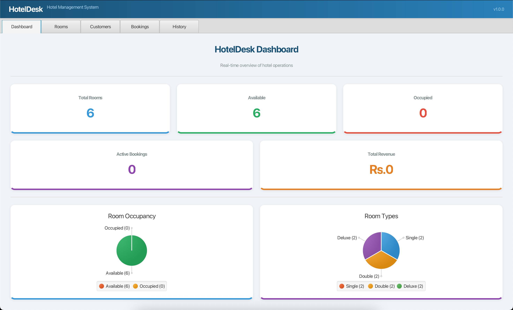
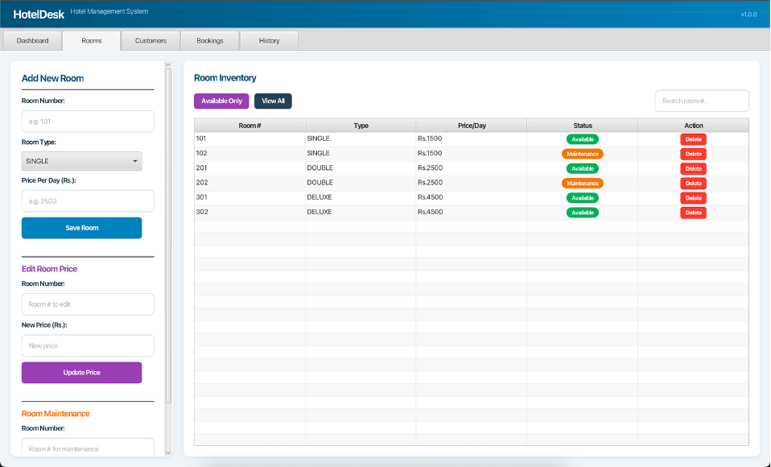
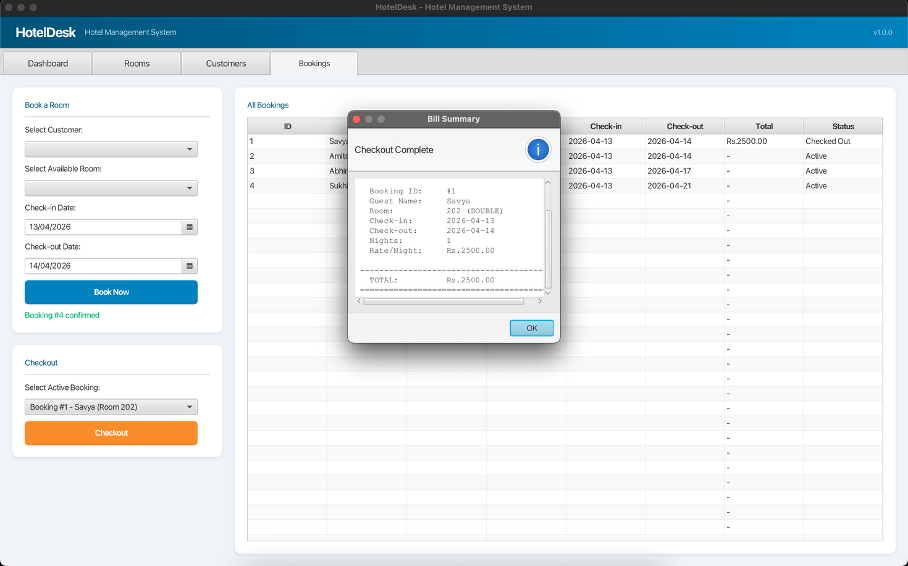
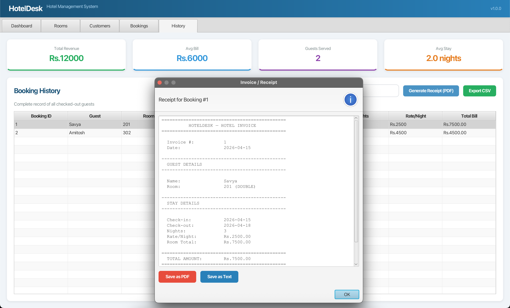

# 🏨 HotelDesk

> A JavaFX 21 hotel management application for front-desk operations — manage rooms, register guests, book and checkout with automated billing, receipt generation, and a live dashboard. No database required.


---

## 📋 Table of Contents

- [Overview](#overview)
- [Features](#features)
- [Screenshots](#screenshots)
- [Tech Stack](#tech-stack)
- [Project Structure](#project-structure)
- [Getting Started](#getting-started)
- [How to Use](#how-to-use)
- [Architecture](#architecture)
- [Contributing](#contributing)

---

## Overview

HotelDesk is a standalone desktop application built with JavaFX that automates the core operations of a hotel front desk. It replaces manual, paper-based processes with a clean tab-based GUI covering room inventory, guest registration, bookings, checkout with automatic bill generation, receipt export, and a real-time operations dashboard with charts.

All data is stored in memory using JavaFX `ObservableList` collections — no database, no external services, just run and go.

---

## Features

### 🛏 Room Management
- Add rooms with number, type (Single / Double / Deluxe), and price per day
- **Edit room price** — update pricing without deleting the room
- **Room maintenance mode** — toggle rooms to "Under Maintenance" status (orange badge)
- Delete rooms (only if not occupied)
- View all rooms in a sortable, searchable table
- Filter to show available rooms only
- Live status badges — green **Available**, red **Occupied**, orange **Maintenance**
- Input validation: digits-only room number, decimal-only price field

### 👤 Customer Management
- Register guests with name and 10-digit contact number
- Contact field enforces digits-only with 10-character limit
- Assigned Room column updates automatically when a booking is made
- Delete customers (blocked if active booking exists)
- Live search by name, ID, or phone number
- Live occupancy percentage widget

### 📋 Booking & Checkout
- Select a customer and an available room from smart dropdowns
- Custom ComboBox display shows ID, name, contact, room type, and price
- **DatePicker** for check-in and check-out dates
- Past dates disabled for check-in; dates before check-in disabled for check-out
- Auto-adjusts check-out when check-in changes
- Live "Stay Duration: X nights" display
- **Estimated total** shown for active bookings in the table
- Checkout computes the bill: `nights × price per day` (minimum 1 night)
- Full bill summary shown in a confirmation dialog
- Maintenance rooms excluded from booking dropdown
- Search bookings by guest name, booking ID, or room number

### 📊 Dashboard
- Five live metric cards: Total Rooms, Available, Occupied, Active Bookings, Revenue
- **Occupancy Pie Chart** — Available vs Occupied (green/red)
- **Room Types Pie Chart** — Single / Double / Deluxe distribution
- **Bookings Bar Chart** — booking count per room type
- All charts and numbers update in real time via `ListChangeListener`
- No manual refresh needed

### 📜 History & Analytics
- Complete record of all checked-out guests
- Four analytics cards: Total Revenue, Average Bill, Guests Served, Average Stay
- Search history by guest name, booking ID, or room number
- **Export to CSV** — save full history as `.csv` file
- **Generate Receipt** — select a booking → view formatted invoice → save as `.txt` file
- Receipt includes: guest details, stay details, rate breakdown, total amount
- Analytics auto-update when new checkouts occur

---

## Screenshots

<table>
  <tr>
    <th>Dashboard</th>
    <th>Room Management</th>
  </tr>
  <tr>
    <td></td>
    <td></td>
  </tr>
  <tr>
    <th>Booking & Checkout</th>
    <th>History & Receipt</th>
  </tr>
  <tr>
    <td></td>
    <td></td>
  </tr>
</table>

---

## Tech Stack

| Technology | Version | Purpose |
|------------|---------|---------|
| Java | JDK 21 LTS | Runtime |
| JavaFX | 21.0.2 | UI framework |
| Maven | 3.8+ | Build and dependency management |
| javafx-maven-plugin | 0.0.8 | `mvn javafx:run` launcher |

No third-party libraries. No database. Pure JavaFX.

---

## Project Structure

```
src/main/java/com/hotel/hoteldesk/
│
├── Main.java                     # Entry point — wires managers → views → Stage
│
├── model/
│   ├── RoomType.java             # Enum: SINGLE, DOUBLE, DELUXE
│   ├── Room.java                 # POJO with BooleanProperty (available + maintenance)
│   ├── Customer.java             # POJO with IntegerProperty (live room assignment)
│   └── Booking.java              # POJO with checkout() — computes bill, records dates
│
├── manager/
│   ├── RoomManager.java          # Room CRUD, filter, maintenance toggle, stats
│   ├── CustomerManager.java      # Customer CRUD, search, active booking check
│   └── BookingManager.java       # book() + checkout() logic, revenue tracking
│
└── view/
    ├── DashboardView.java        # Metric cards + Pie Charts + Bar Chart
    ├── RoomView.java             # Add/Edit/Delete/Maintenance + filtered table
    ├── CustomerView.java         # Registration + search + delete + occupancy
    ├── BookingView.java          # Book + checkout + date pickers + search
    └── HistoryView.java          # Analytics + history table + CSV export + receipt
```

**Total: 13 Java files + 1 pom.xml + 1 module-info.java**

---

## Getting Started

### Prerequisites

- [JDK 21+](https://adoptium.net) — Temurin 21 LTS recommended
- [IntelliJ IDEA Community](https://www.jetbrains.com/idea/) — free edition
- Maven is bundled with IntelliJ, no separate install needed

### Clone the Repository

```bash
git clone https://github.com/your-username/HotelDesk.git
cd HotelDesk
```

### Run with Maven

```bash
mvn clean javafx:run
```

### Run in IntelliJ

1. Open IntelliJ → **File → Open** → select the project folder
2. Wait for Maven to download dependencies (first run only)
3. Open the **Maven** panel on the right → **Plugins → javafx → javafx:run**
4. Double-click `javafx:run`

The app launches with **6 pre-loaded sample rooms** so you can test immediately.

---

## How to Use

### Add a Room
1. Go to the **Rooms** tab
2. Enter a room number, select a type, enter the price per day
3. Click **Save Room** — it appears in the table instantly

### Edit Room Price
1. In the **Rooms** tab, scroll to "Edit Room Price" section
2. Enter the room number and new price
3. Click **Update Price** — table refreshes immediately

### Toggle Maintenance
1. In the **Rooms** tab, scroll to "Room Maintenance" section
2. Enter the room number
3. Click **Toggle Maintenance** — room status changes to orange "Maintenance"
4. Click again to restore to "Available"
5. Maintenance rooms cannot be booked

### Register a Guest
1. Go to the **Customers** tab
2. Fill in the guest's name and 10-digit contact number
3. Click **Register Customer**

### Book a Room
1. Go to the **Bookings** tab
2. Select a customer from the dropdown
3. Select an available room
4. Pick check-in and check-out dates
5. Click **Book Now** — confirmation shows dates, nights, and estimated total

### Checkout a Guest
1. In the **Bookings** tab, go to the Checkout section
2. Select the active booking from the dropdown
3. Click **Checkout** — bill summary shows nights, rate, and total
4. Room is automatically released back to Available

### View Dashboard
Switch to the **Dashboard** tab — all stats, pie charts, and bar chart update live.

### Export History
1. Go to the **History** tab
2. Click **Export CSV** — choose save location
3. Full checkout history saved as `.csv` file

### Generate Receipt
1. Go to the **History** tab
2. Click on a booking row to select it
3. Click **Generate Receipt** — formatted invoice appears
4. Click **Save as Text File** to save the receipt

---

## Architecture

The app follows a clean three-layer architecture:

```
┌─────────────────────────────────────────────────┐
│              PRESENTATION LAYER                  │
│  DashboardView, RoomView, CustomerView,          │
│  BookingView, HistoryView                        │
│  (JavaFX controls — no business logic)           │
├─────────────────────────────────────────────────┤
│             BUSINESS LOGIC LAYER                 │
│  RoomManager, CustomerManager, BookingManager    │
│  (Own ObservableLists, enforce all invariants)   │
├─────────────────────────────────────────────────┤
│                DATA LAYER                        │
│  Room, Customer, Booking, RoomType               │
│  (POJOs with JavaFX properties for binding)      │
└─────────────────────────────────────────────────┘
```

### Key Design Patterns

| Pattern | Where | Purpose |
|---------|-------|---------|
| **Observer** | BooleanProperty, IntegerProperty | Auto UI refresh on data change |
| **MVC** | Model → Manager → View | Clean separation of concerns |
| **Extractor** | `observableArrayList(r -> new Observable[]{...})` | Fire UPDATE events on property changes |
| **Filtered List** | Rooms, History, Search | Dynamic filtering without new lists |
| **Factory** | `setCellFactory` | Custom table cell rendering |
| **Delegation** | Views → Managers | Views contain no business logic |

### Key Design: Observable Extractor Pattern

```java
FXCollections.observableArrayList(
    r -> new Observable[]{ r.availableProperty(), r.underMaintenanceProperty() }
)
```

This tells JavaFX to fire a list `UPDATE` event whenever a room's `available` or `underMaintenance` property changes — not just when rooms are added or removed. Every bound `TableView` column re-renders automatically on every book, checkout, and maintenance toggle with zero additional code.

---

## Key Technical Highlights

- **Zero third-party dependencies** — only JavaFX SDK
- **Reactive UI** — all views update automatically via observable bindings
- **Input validation** — digits-only fields, 10-char phone limit, date constraints
- **3 room states** — Available (green), Occupied (red), Maintenance (orange)
- **Smart ComboBoxes** — custom ListCell + ButtonCell prevent blank display
- **Layered FilteredList** — search filters on top of status filters
- **DatePicker constraints** — past dates disabled, auto-adjustment
- **Monospaced receipt** — Courier New formatted invoice with consistent alignment
- **CSV export** — standard format compatible with Excel/Google Sheets
- **Minimum 1280×720** resolution support

---

## Contributing

Pull requests are welcome. For major changes, please open an issue first to discuss what you'd like to change.

1. Fork the repository
2. Create your feature branch: `git checkout -b feature/your-feature`
3. Commit your changes: `git commit -m "Add your feature"`
4. Push to the branch: `git push origin feature/your-feature`
5. Open a Pull Request

---

## License

This project is licensed under the MIT License — see the [LICENSE](LICENSE) file for details.

---

<p align="center">
  Built with ❤️ using JavaFX 21
</p>
